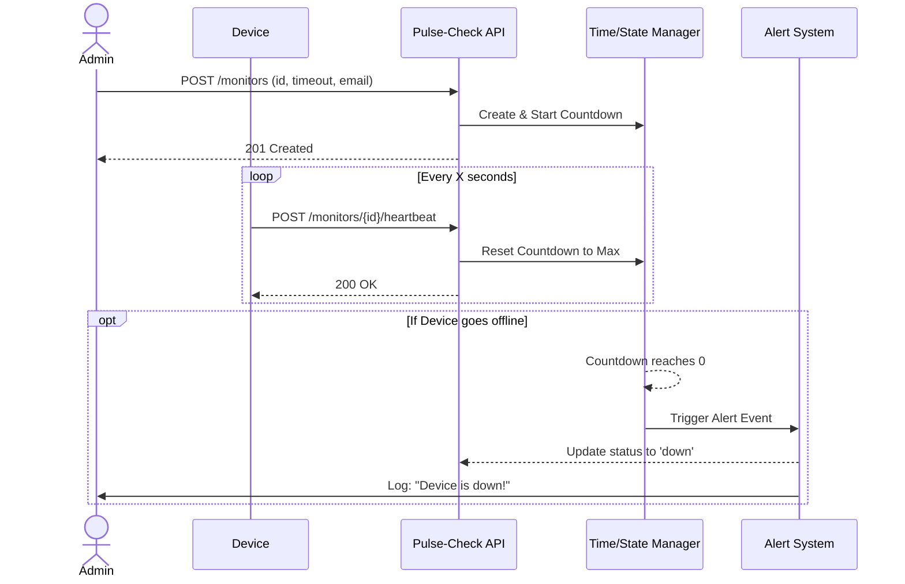

<div align="center">
  <h1> Pulse-Check API</h1>
  <p>A lightweight, stateful dead-man's switch API built for CritMon Servers Inc. This service allows remote devices to register heartbeat monitors. If a device fails to check in before its timer expires, the API automatically fires a critical alert.</p>
</div>

<!-- 
# Pulse-Check API -->

## 1. Architecture Flow

The following sequence diagram outlines the core state management and background watchdog logic.



## 2. Setup Instructions
This application is built using Python 3 and FastAPI.

### 1. Clone and Navigate:

```bash
git clone <your-repository-url>
cd pulse-check-api
```

### 2. Set up a Virtual Environment:

```bash
python -m venv venv
source venv/bin/activate  # On Windows: venv\Scripts\activate
```

### 3. Install Dependencies:

```bash
pip install -r requirements.txt
```

### 4. Run the Server:

```bash
uvicorn main:app --reload
```

The server will start on [here](http://127.0.0.1:8000)

## 3. API Documentation
Once the server is running, you can interact with the live interactive API documentation (Swagger UI) by navigating to: 
### [Click Here](http://127.0.0.1:8000/docs)

### Core Endpoints:
- POST /monitors

    * **Description:** Register a new device monitor and start the countdown timer.

    * **Payload:** {"id": "device-123", "timeout": 60, "alert_email": "admin@critmon.com"}

    * **Response:** 201 Created

- POST /monitors/{id}/heartbeat

    * **Description:** Send a ping from a remote device to reset its countdown timer. If the device was paused, this automatically un-pauses it.

    * **Response:** 200 OK

- POST /monitors/{id}/pause

    * **Description:** Suspends the timer for maintenance without triggering alerts. Changes device status to paused.

    * **Response:** 200 OK

## 4. System Dashboard

### Feature Added: GET /monitors

**Why I added it:**

Originally, CritMon administrators previously had no way to view the overall health of their network. I added a dashboard endpoint that returns a real-time snapshot of all registered devices. It displays their current statuses (active, down, paused) and dynamically calculates the exact "time_left_seconds" before an active device triggers an alarm. This adds significant operational value and paves the way for a real-time frontend UI.
